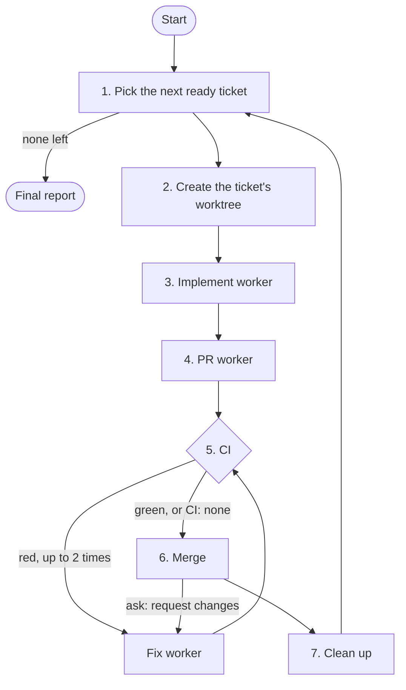

# How the loop works
{: .no_toc }

`/ship-tickets` runs the loop written for the agent in [`skills/ship-tickets/ship-tickets-loop.md`](https://github.com/samfaina/agent-skills/blob/main/skills/ship-tickets/ship-tickets-loop.md). This page explains it for people. When the two disagree, the loop file is what runs.

1. TOC
{:toc}

## Before the first ticket

The coordinator:

- finds `orca` on your `PATH` and loads Orca's orchestration guide, the source of truth for every worker command;
- reads `docs/agents/shipping.md` from the remote default branch and stops if it isn't there;
- turns your arguments, or every open `ready-for-agent` issue, into the **ticket set**;
- settles the **merge approval**: `ask` or `auto` from your arguments, otherwise the **Merge approval** field in `shipping.md`, otherwise `ask`;
- reads from the **Workers** field which harness each worker role starts in;
- checks that the implement worker's harness will load the `tdd` and `code-review` from mattpocock/skills, and stops if it would load another skill with the same name (see [the provenance check](harnesses#the-skill-provenance-check));
- opens one Orca run for the whole session, which every worker belongs to.

## 1. Pick

A ticket is **ready** when it is open and none of its blockers is: GitHub reports no open blocking issues, and every issue in a `Blocked by:` line of its body is closed. The coordinator takes the lowest-numbered ready ticket.

If tickets are left but none is ready, the loop stops and tells you which open blockers hold them.

## 2. Worktree

The coordinator fetches and creates an Orca worktree for the issue, branched from the base branch on the remote. The branch name follows the naming rule in `shipping.md`.

Because tickets ship one at a time, each worktree starts from a base that already has the previous ticket merged.

## 3. Implement

A fresh agent gets the implement spec, in the harness **Workers** names for the implement role. It reads the issue and anything it links, builds test-first with the `tdd` skill, runs the full test suite, reviews its own diff against the issue with `code-review`, fixes what that finds, and commits. It doesn't push. Its report names the folder it loaded each of the two skills from. If it can't load one of them, it fails and names the missing skill.

If the worker has a question, it asks the coordinator. The coordinator answers from the ticket and the repo when it can, and otherwise asks you and passes your answer on.

The coordinator accepts the work only when the branch has new commits, the working tree is clean, and both skills came from the folders the check before the first ticket found.

## 4. PR

A second fresh agent, in the same worktree, pushes the branch and opens the PR with the title and body format from `shipping.md`, working from the commits, the diff and the issue. The body ends with `Closes #<n>`.

The coordinator checks the PR is on the ticket's branch and that `Closes #<n>` is in its body.

## 5. CI

The coordinator waits until GitHub lists checks for the PR, which can take a few minutes after a push, and then until they finish. If no check starts within 10 minutes, the loop stops.

How it waits depends on its harness. Where the harness notifies it when a background command exits, as Claude Code does, it waits in the background. Otherwise it waits in the foreground and starts the wait again when it times out. [Harnesses](harnesses#waiting-on-ci) covers each one.

- **Green:** go to the merge.
- **Red:** a fix worker reads the failing logs, reproduces the failure locally, fixes it and pushes, then CI runs again. A ticket gets at most two fix workers for CI. The third red run stops the loop.

With `CI: none` in `shipping.md`, this step is skipped.

## 6. Merge

The coordinator merges with the merge method from `shipping.md`. The merge approval it settled before the first ticket decides whether you approve first:

| Merge approval | What happens |
| --- | --- |
| `ask` (default) | Shows you the PR link, title and size, and asks: **Merge**, **Request changes** or **Stop**. Requested changes go to a fix worker, then back through CI and this question. Review rounds have no limit. |
| `auto` | Merges right away. |

The coordinator asks with its harness's question tool where it has one, and in plain text otherwise. [Harnesses](harnesses#asking-you-a-question) shows what to expect in each.

After the merge, the coordinator checks the issue closed, and closes it with a comment pointing at the PR if it didn't.

## 7. Clean up

The coordinator runs the after-merge step from `shipping.md` (deleting the remote branch, for example), removes the worktree, and checks that no worker from the run is left behind. Then it picks the next ticket.

## Workers and specs

Each worker starts in the harness that the **Workers** field in `shipping.md` names for its role: implement, PR or fix. One harness can run every role, or each role can have its own. A file without the field runs them all in Claude Code. See [Workers](harnesses#workers).

Every worker gets a written spec with the same five parts: **Target**, **Change**, **Constraints**, **Ownership** and **Observable acceptance**. The last one is the check the coordinator runs before accepting the work. A worker reporting success isn't enough on its own.

Workers in the same worktree don't share context. Each one starts empty, reads the issue, the repo and its spec, and settles with a single result.
